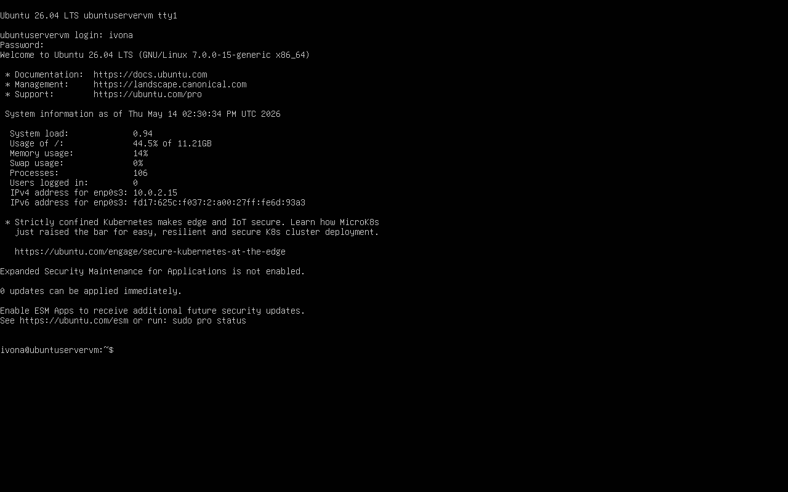
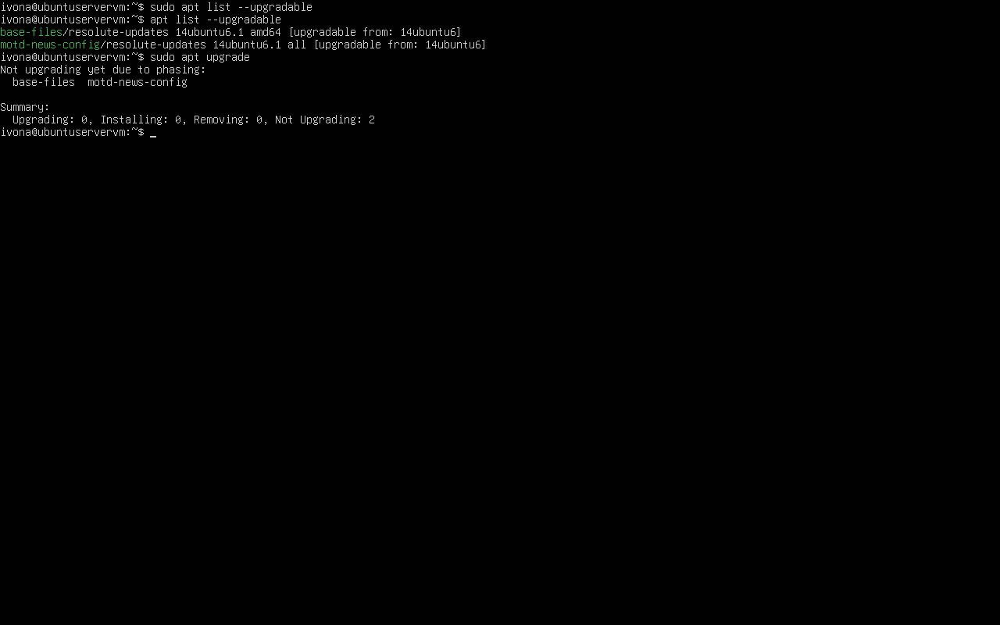
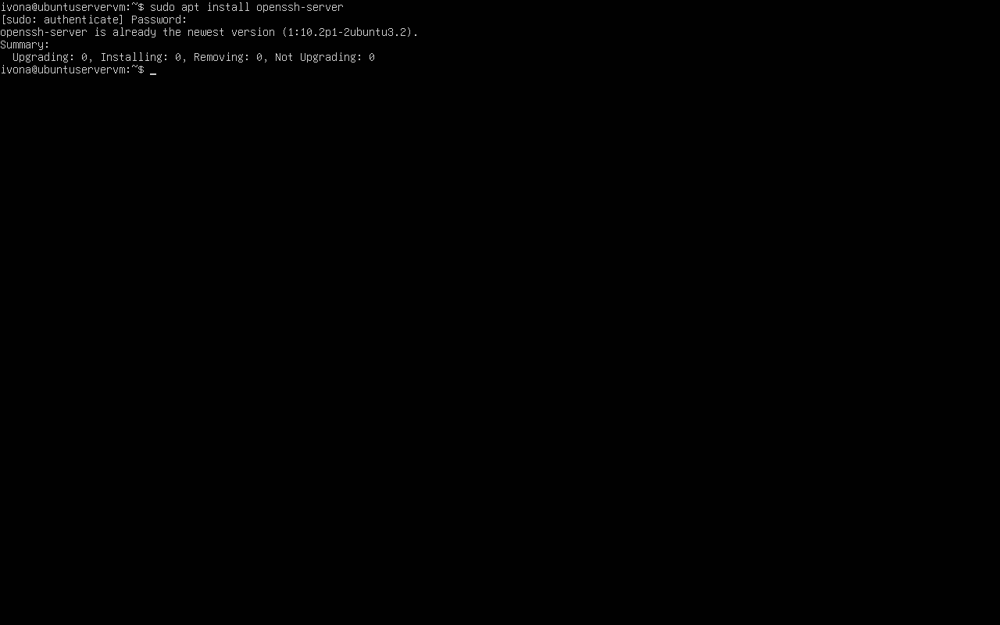
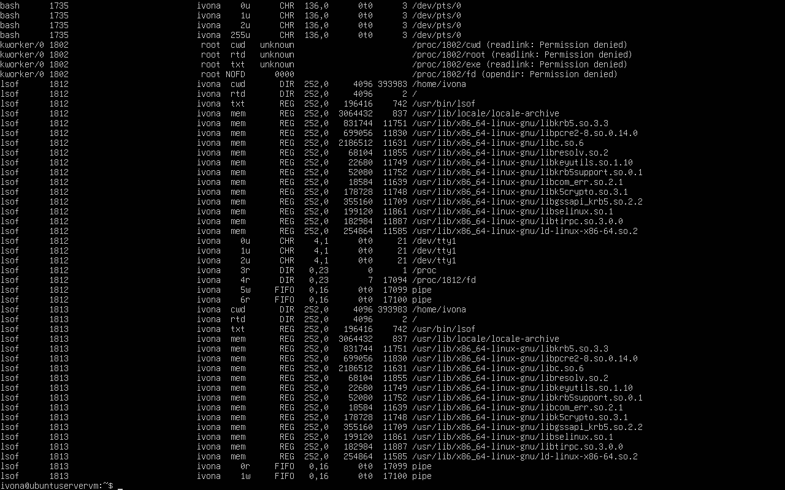
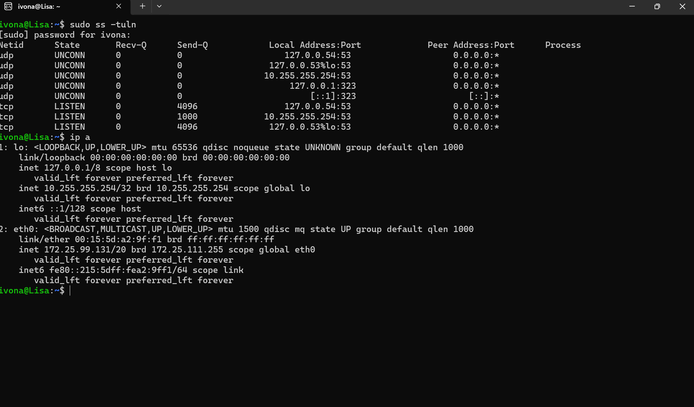
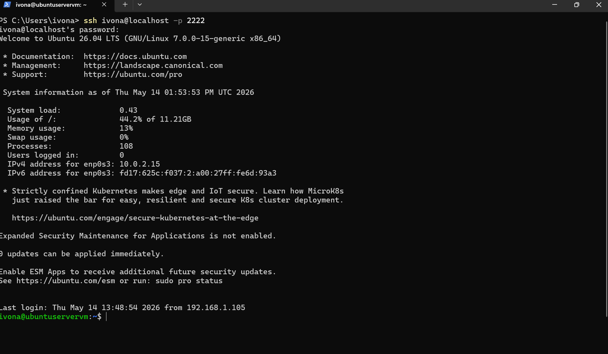
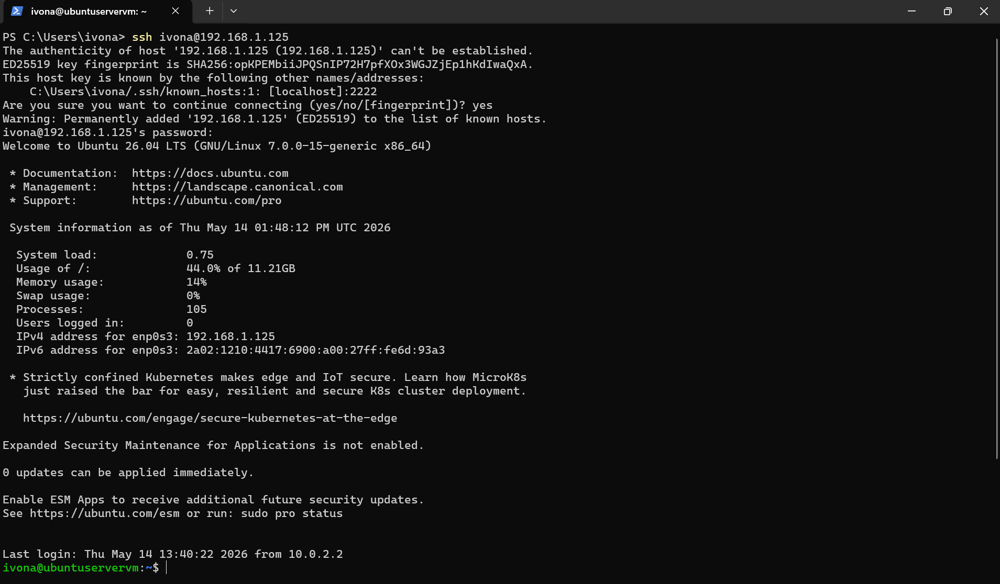
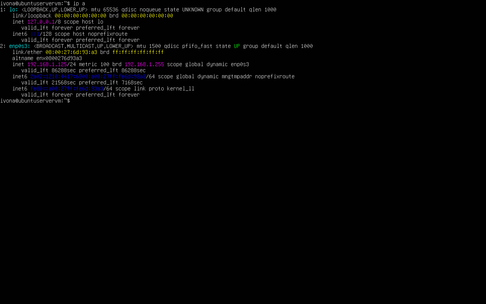
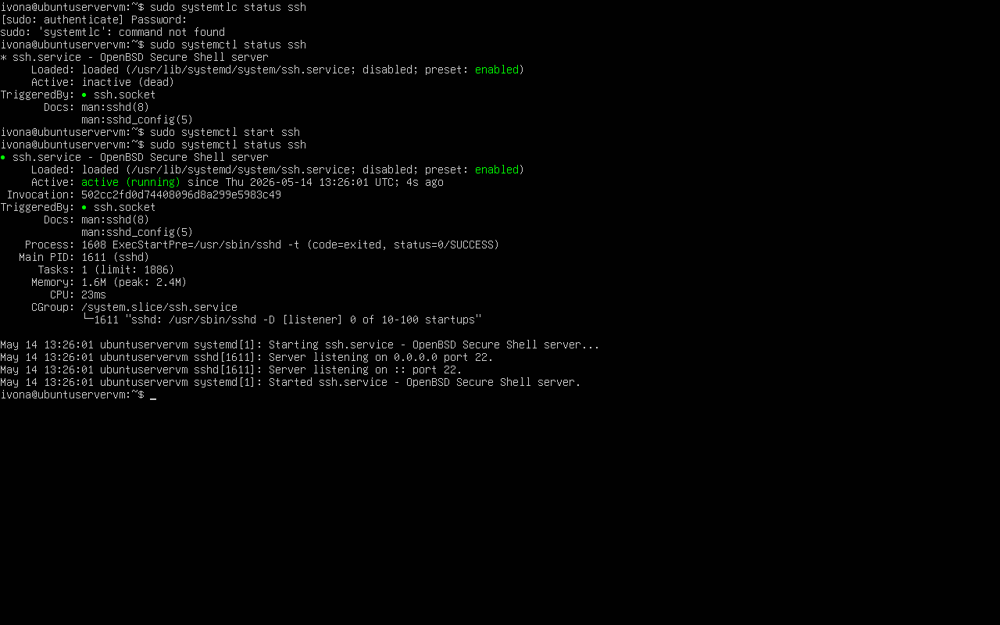
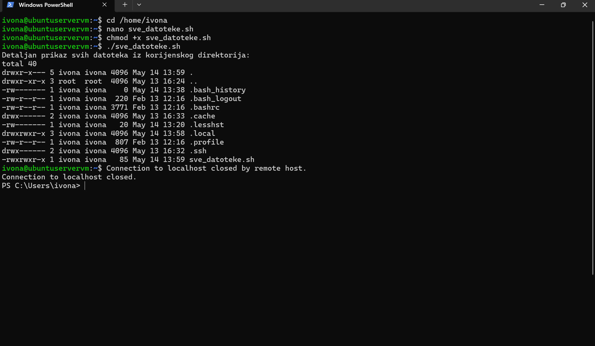

# OS4 - Virtual Machine 

Komentar: Izrađivala sam Virtual Box prateći skriptu, tako da sam vidjela da ime korisnika mora biti u formatu ime.prezime tek na kraju. Ja sam davno prije toga već postavila ime samo kao "ivona". Nadam se da to nije problem.

### Početni zaslon VM-a

### Ažuriranje paketa 

### Instalacija OpenSSH-a

### Otvoreni portovi

### Alat ss

### Port Forwarding

### Bridged Adapter

### Local Host adresa

### SSH status

### Skripta

### Prikaz datoteka

