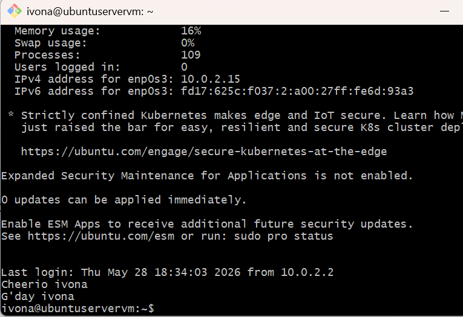
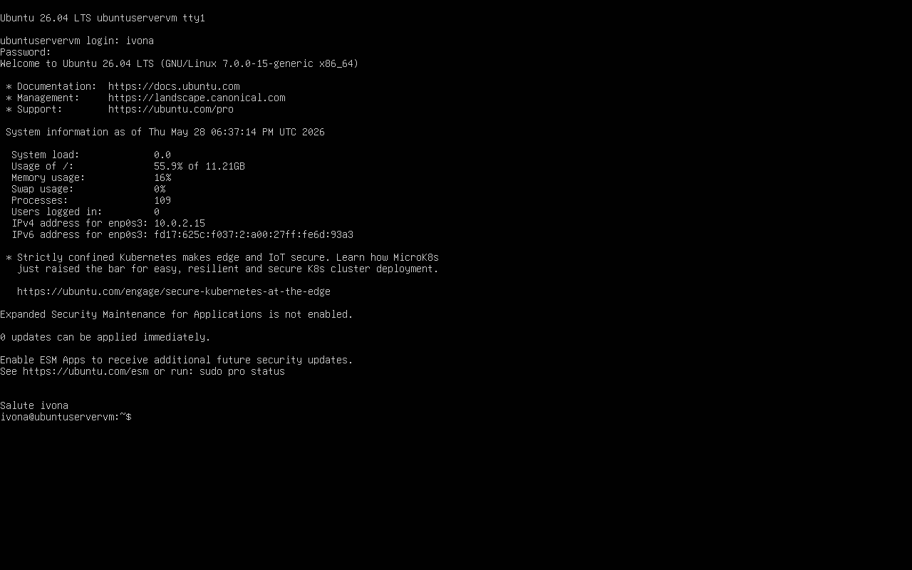

#OS5 - 1.zadatak: Ubuntu server, JavaScript, Node.js i krave :D

##1. 
Već sam instalirala.

##2.
sudo apt update
apt list --upgradable
sudo apt upgrade

nodejs je vec instaliran
sudo apt install npm

##3. 
Provjera jesu li instalirani 

1. nodejs -v, npm -v
2. apt list --installed | grep npm
   apt list --installed | grep nodejs

##4.
node
.exit
pwd
mkdir node_project

##5. 
cd node_project
nano hello.js

const ime = "Ivona Papa"
console.log(`Pozdrav ja sam ${ime} i uspjesno sam pokrenula JS u Nodejs okruzenju!`);
ctrl+o
Y
ctrl+x
nodejs hello.js

##6.
sudo apt install cowsay
nano krava.sh
$#/bin/bash
if [ $# -ne 1 ]; then
	echo "Morate unijeti jedan argument."
	exit 1
fi

##8.
u krava.sh izmijeniti:

#!/bin/bash
if [ $# -ne 1 ]; then
	echo "Morate unijeti jedan argument."
	exit 1
else  
	poruka=$1
	cowsay $1
fi

##9.
chmod +x krava.sh
./krava.sh "$(node hello.js)"

##10. 
Zastavice -e eye_string - prva dva znaka stringa su oči 
-f cowfile - specificira sliku krave koja će se koristiti
-h 
-l lista sve slike krava u COWPATH-u
-n specificira razmake u poruci koja se koristi
-T tongue_string - pravilo kao i za oči
-W column - specificira gdje će se prikazati poruka u kravi
-b Borg krava
-d mrtva krava
-g pohlepna krava
-p paranoicna krava
-s napušena krava
-t umorna krava
-w energicna krava
-y pomlađena krava

#OS5 - 2.zadatak: Git - information manager from hell

##1. 
sudo apt install git 
git -v

##2. 
git clone https://github.com/git/git.git 
ls 
cd git
ls

##3. 
git-log(1) - show commit logs

##4. 
git log --reverse

##5. 
ok :)

##6. 
npm init -y
nano package.json
"author": "Ivona Papa",

##7. 
npm install greetings
nano welcome.js 

kopirala sam kod

node welcome.js

##8. 
nano pozdrav.sh
#!/bin/bash
echo "$USER $(node welcome.js)"

chmod +x pozdrav.sh
./pozdrav.sh

##9. 
~/.bashrc
echo "$(node welcome.js) $USER"

~/.ssh/rc 
echo "$(node welcome.js) $USER"

##10.

