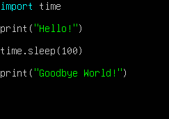
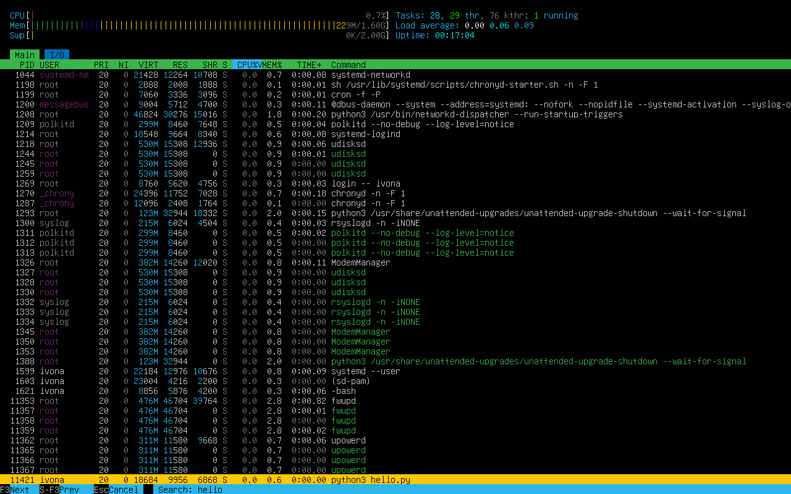
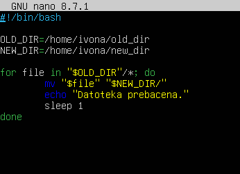
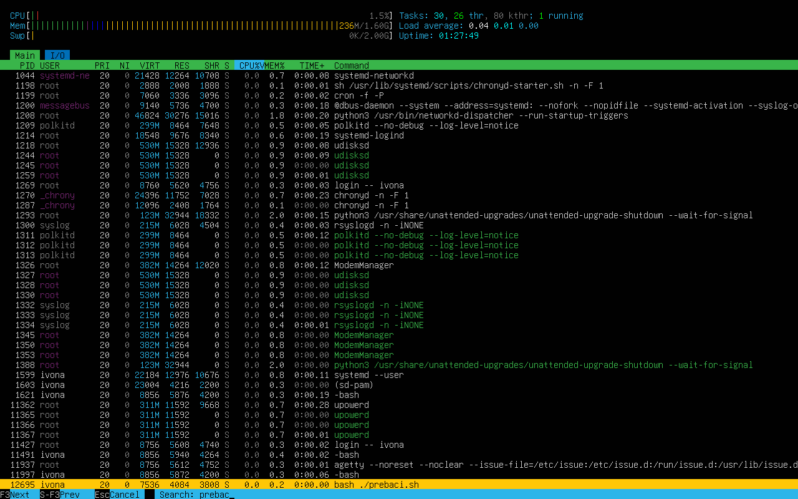
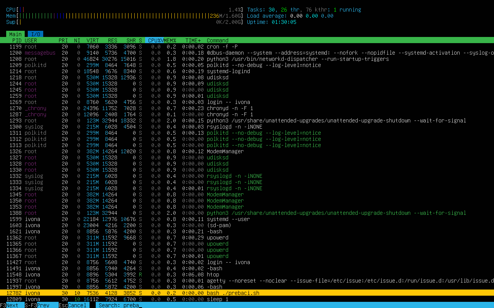
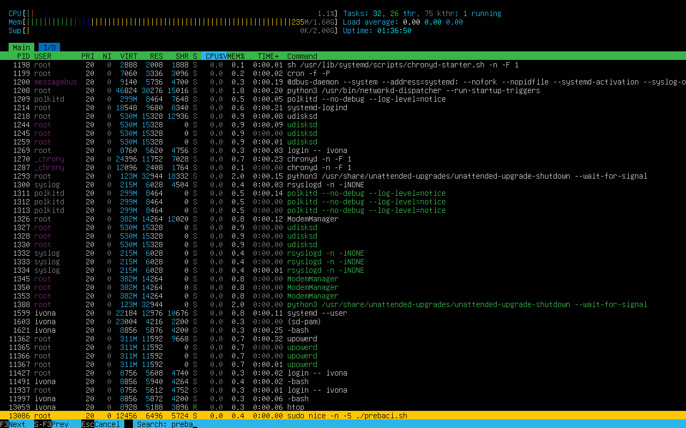
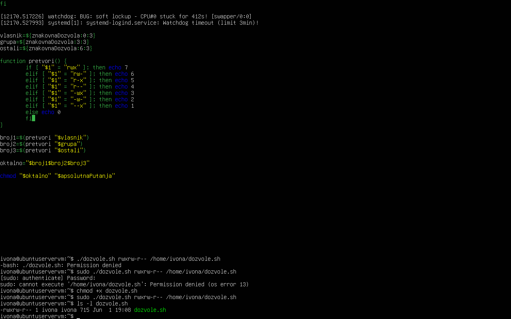

OS5
# Zadatak 1
Instalirajte python3 paket na vašem VM-u. Unutar home direktorija stvorite direktorij python3 i datoteku
hello.py koja ispisuje "Hello World!", a nakon 100 sekundi ispisuje "Goodbye World!".
Pokrenite skriptu i prebacite se u drugi terminal ili pokrenite u pozadini. Unutar htop alata ispišite i
objasnite sve detalje o procesu koji je pokrenut.
Napišite barem 3 načina kako biste prekinuli taj proces naredbom kill 

sudo apt install python3
pwd //direktorij je već home
mkdir python3 && cd python3 && nano hello.py

htop- /hello 
Process ID - 11421
user - ivona

Priority - 20 - low priority
Nice priority - 0, default

Virtual memory occupied - 18684
Resident memory - 10044
Shared memory - 6956
- koristi se vrlo malo memorije

Status - sleeping, jer čeka da istekne 100 sekundi
zato je 
CPU% 0.0
MEM% 0.6
Time - 0
Command - python3 hello.py

3 načina gašenja - 
kill 11421
kill -9 11421
pkill python3

# Zadatak 2
cd .. && mkdir old_dir && mkdir new_dir
cd old_dir
touch kravisa.sh && touch hiThere.py && touch ounou.js 
touch fajl1.py && touch fajl2.py && fajl.sh && fajl2.sh
&& fajl3.sh && fajl.js && fajl2.js && fajl3.js
cd .. 

nano prebaci.sh

Ctrl+O
Y
Ctrl+X

chmod +x prebaci.sh
./prebaci.sh - normalni prioritet

nice -n 10 ./prebaci.sh - manji prioritet

sudo nice -n -5 ./prebaci.sh - veći prioritet, zato treba sudo

# Zadatak 3
whoami
sudo -i
groupadd devteam
mkdir project
useradd -m -s /bin/bash korisnik1
itd. za vise korisnika
(koristena imena korisnika: cobra, buco, mrx, dragec, mayalo, stefek, nosonja, papirus, dunja)
usermod -aG devteam cobra
itd. za sve korisnike
chown :devteam project 
chmod 764 project

# Zadatak 4
rwxr-xr-x = 755
Vlasnik može čitati, pisati, izvršavati.
Grupa i ostali korisnici mogu čitati i izvršavati. 

rw-r--r-- = 644
Vlasnik može samo čitati i pisati, grupa i ostali korisnici mogu samo čitati. 

rwx------ = 700
Vlasnik može čitati, pisati, izvršavati, grupe i ostali korisnici ne mogu ništa. 

rw-rw-r-- = 664
Vlasnik i grupe mogu čitati i pisati, ostali korisnici mogu samo čitati. 

rwxrwxrwx = 777
Svi mogu čitati, pisati i izvršavati. 

r--r--r-- = 444
Svi mogu samo čitati. 

rw------- = 600
Vlasnik može čitati i pisati, nitko drugi ne može ništa. 

# Zadatak 5
nano dozvole.sh

